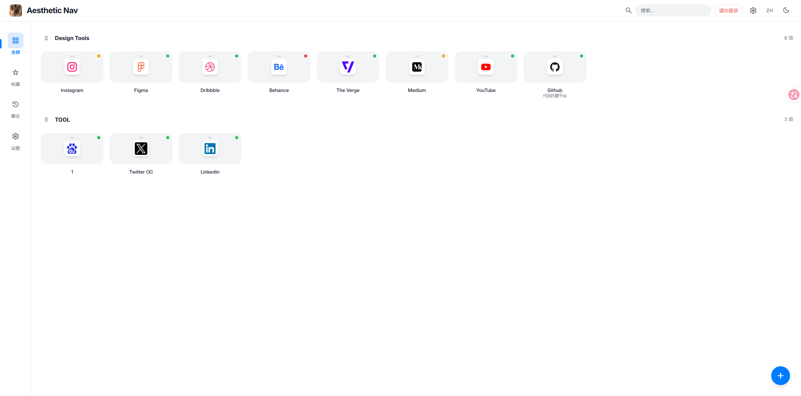
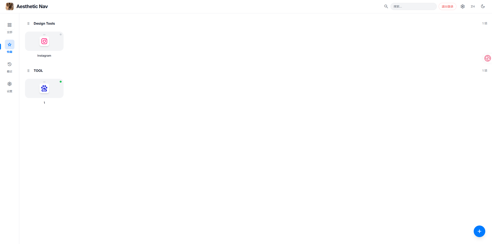
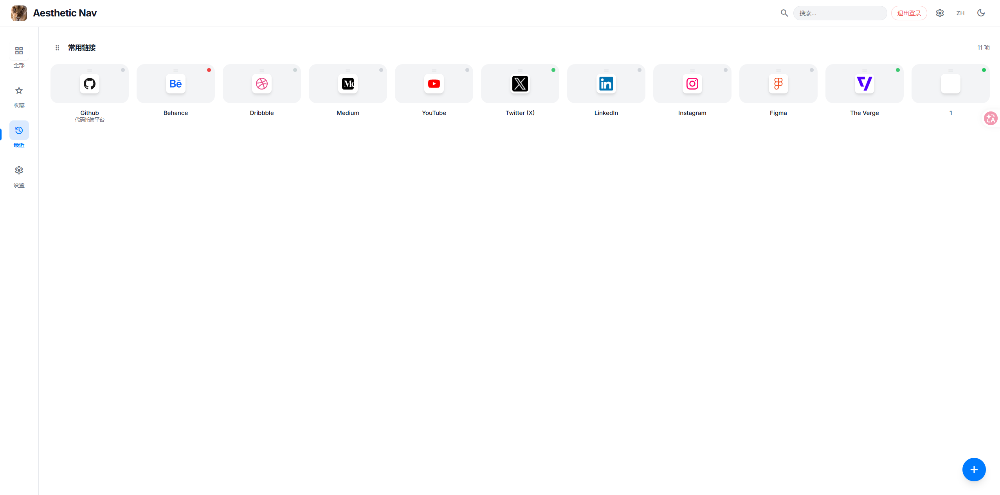

# Aesthetic Navigation Dashboard 🚀


**Aesthetic Nav** 是一个专为追求极致视觉体验与高效管理的用户打造的个人导航门户。它采用响应式设计，支持拖拽管理，并内置了智能图标抓取策略。

---

## ✨ 核心特性

- 🎨 **极致美学设计**：采用现代化的 UI 风格，支持**深色/浅色模式**无缝切换。大量运用毛玻璃特效（Glassmorphism）、平滑过渡动画与圆润的高级感布局。
- 🖱️ **自由拖拽排序 (WYSIWYG)**：
    - **所见即所得**：开启管理员模式后，所有排序调整均可通过拖拽完成并即时保存。
    - **跨分类移动**：支持将链接从一个类别直接拖动到另一个类别。
    - **分类重排**：支持对整个分类版块进行拖拽排序。
    - **类别内精细排序**：支持对每个分类内部的 item 进行精确位置调整。
- � **智能元数据抓取**：
    - **一键刷新**：在添加/编辑链接时，点击 URL 输入框旁的刷新按钮，自动抓取目标网站的标题、描述和图标。
    - **实时预览**：抓取成功后立即显示图标预览，所见即所得，确保保存前就能看到最终效果。
    - **强制更新**：修改链接地址后，可强制重新抓取最新信息，不受缓存影响。
- �🖼️ **智能图标爬取策略**：内置三层兜底图标获取逻辑，确保每个链接都美观：
    1. **Simple Icons CDN**: 优先匹配 3000+ 知名品牌的高质量 SVG 图标。
    2. **Google Favicon API**: 若品牌库未匹配，则通过目标域名的 Favicon 接口进行抓取。
    3. **动态文本图标**: 若以上均失效，则自动生成基于标题首字母的渐变色文字头像。
- 🚦 **实时访问指示灯**：每个项目自带状态指示灯（灰色-检查中，绿色-可访问，红色-连接失败），实时反馈目标网站的可访问性。
- ⚡ **高级自定义选择器**：完全重写的分类选择组件，提供丝滑的动效与磨砂玻璃质感。
- 🔍 **智能搜索与过滤**：毫秒级响应的全局实时检索，支持“全部”、“我的收藏”、“最近使用”等维度。
- 🛠️ **全能管理后台**：基于 JWT 的管理员认证体系，支持在线添加、编辑、删除链接。

---

## 🛠️ 技术栈

- **后端**: [FastAPI](https://fastapi.tiangolo.com/) (Python) - 高性能异步 Web 架构。
- **数据库**: [SQLite](https://sqlite.org/) - 轻量级、持久化的嵌入式数据库。
- **前端**: [Tailwind CSS](https://tailwindcss.com/) + Vanilla JavaScript。

---

## 🚀 快速开始

### 默认账户
- **用户名**: `admin`
- **默认密码**: `admin123`  *(登录后请尽快在设置中修改)*

### Docker 部署 (推荐)
使用 Docker 可以快速在服务器上部署并实现 0.0.0.0 监听，方便直接访问或进行反向代理。

1. **环境准备**：
   确保已安装 `docker` 和 `docker-compose`。

2. **克隆仓库**：
   ```bash
   git clone https://github.com/JinShuo0510/aesthetic-nav.git
   cd aesthetic-nav
   ```

3. **启动服务**：
   ```bash
   docker-compose up -d
   ```
   > 首次启动会自动从 GitHub Container Registry 拉取预构建镜像。

4. **更新服务**（后续代码更新后）：
   ```bash
   docker-compose pull && docker-compose up -d
   ```

5. **反向代理配置**：
   服务默认运行在 `8001` 端口，您可以直接使用 Nginx 等工具进行反代。

### 本地手动运行
1. **安装依赖**：
   ```bash
   pip install -r requirements.txt
   ```
2. **运行**：
   ```bash
   python -m uvicorn main:app --host 0.0.0.0 --port 8001
   ```

---

## 📸 预览

以下是 **Aesthetic Nav** 的核心视觉交互与功能展示：

### 1. 仪表盘全景 (全部视图)
> 自动按类别分组展示，支持分类标题的折叠与排序，布局错落有致。


### 2. 我的收藏 (精选视图)
> 聚合所有标记为“星星”的项目，快速直达最核心的生产力工具。


### 3. 最近访问 (频率视图)
> 动态追踪您的点击偏好，按使用频率和近期活跃度智能排序。



---

## 🏗️ 核心功能深度解析

### 🖱️ 自由拖拽排序 (WYSIWYG)
> 顶部中心位置设有横向拖拽手柄，支持在分类内精细排序或跨分类移动，操作即时持久化。

### 🖼️ 智能图标抓取与状态灯
> 实时访问指示灯（绿/红）直观反馈连接状态。图标自动匹配核心品牌、Favicon 或动态生成。

### ⚡ 高级自定义分类选择
> 彻底抛弃系统原生下拉框，采用磨砂质感的自定义组件，提供更丝滑的交互体验。

### 🔄 智能元数据抓取与图标预览
> **一键获取网站信息**：在添加或编辑链接时，只需输入 URL 并点击旁边的刷新按钮，系统会自动：
> - 访问目标网站并提取页面标题和描述
> - 实时显示图标预览区域，展示即将使用的图标效果
> - 根据网站名称智能匹配图标（Simple Icons → Google Favicon → 首字母头像）
> 
> **强制刷新机制**：修改链接地址后，可随时点击刷新按钮重新抓取最新信息，不受旧数据缓存影响。保存时会自动清空旧的图标缓存，确保显示的是基于新标题生成的图标。

---

## 📄 开源协议

本项目采用 [MIT License](LICENSE) 许可协议。

---

**Aesthetic Nav** - *Navigate your digital world with grace.*
